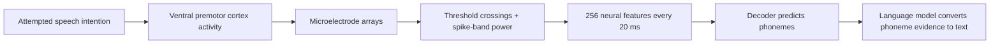
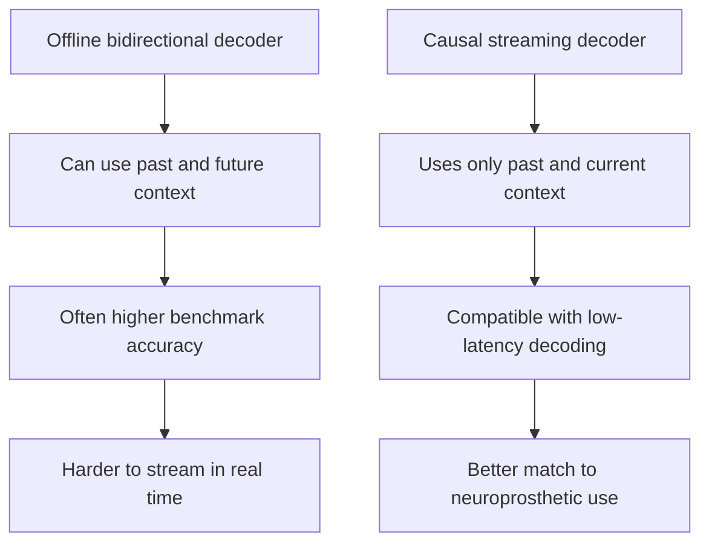
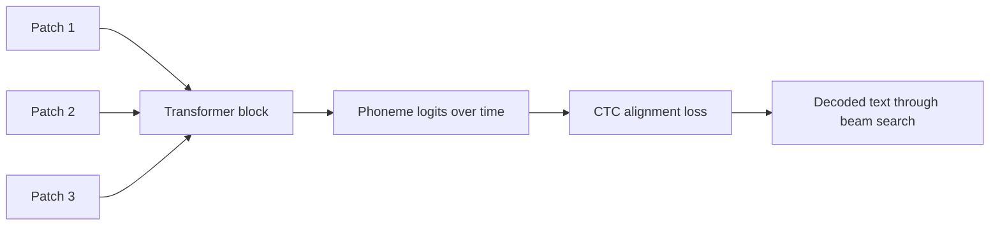
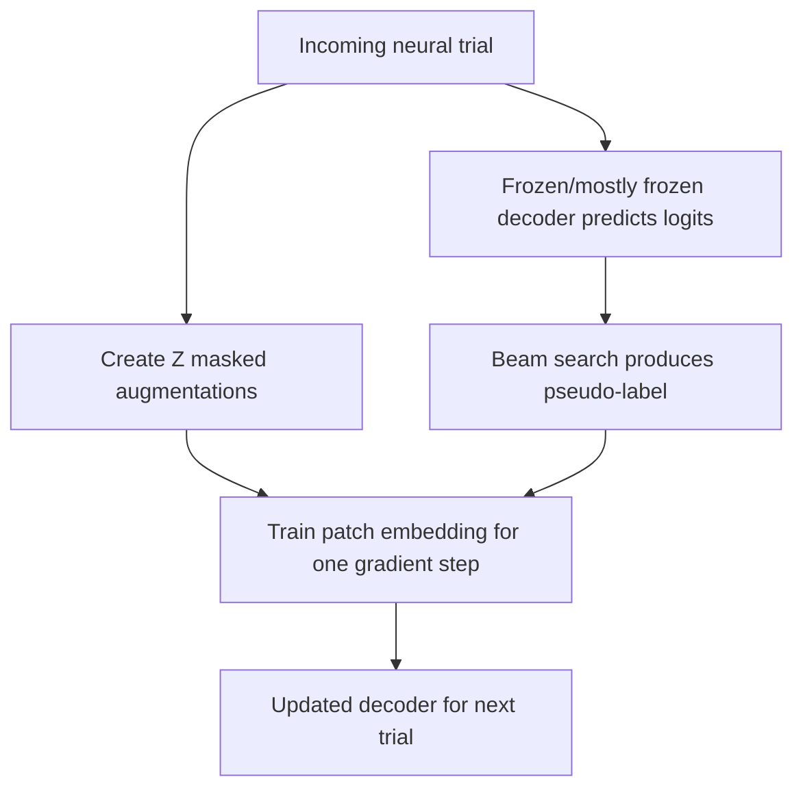

# Time-Masked Transformers with Lightweight Test-Time Adaptation for Neural Speech Decoding

## A Reading Document Written from the Author's Point of View

In this paper, I am trying to solve a very practical version of a very deep problem: how can we turn neural activity from a person who is trying to speak into usable text, quickly enough and cheaply enough that the system could plausibly become a real communication device? The scientific question is not only whether a model can win a benchmark. The clinical question is whether a decoder can work in real time, use modest computation, and keep working when the neural signals drift from day to day.

> "Speech neuroprostheses aim to restore communication for people with severe paralysis"

This sentence is the moral center of the work. I am not treating neural decoding as a generic machine learning puzzle. The reason accuracy, latency, memory, and adaptation all matter is that the end user is someone whose speech pathway is impaired but whose intention to speak remains present.

The paper's central claim is simple: a compact causal Transformer, trained with heavy time masking and paired with a lightweight adaptation method called DietCORP, can improve speech decoding accuracy while reducing computational cost and preserving compatibility with real-time streaming.

> "Together, these contributions reduce word error rate by over 20%"

That quote matters because it shows the paper is making a practical engineering claim, not merely a theoretical one. The proposed method is meant to be more accurate, but also smaller, faster, and easier to adapt.

## The Neuroscience Problem in Plain Language

The participant in the benchmark has ALS and attempts to speak sentences. The system records from microelectrode arrays implanted in ventral premotor cortex, called area 6v. A plain way to think about area 6v is that it is part of the brain's movement planning machinery. When a person tries to speak, the articulators of speech, such as the tongue, lips, jaw, and larynx, are not moving normally in this participant, but the brain still generates structured motor-planning activity related to the attempted speech act.

> "microelectrode array (MEA) recordings from the ventral premotor cortex (area 6v)"

This quote tells us exactly what kind of signal the model receives. These are not scalp EEG recordings, and they are not audio recordings. They are intracortical measurements from a brain area involved in preparing and controlling movements, including the attempted movements of speech.

The raw neural recording is converted into features. For each channel, the dataset provides threshold crossings and spike band power. In simple terms, threshold crossings are counts of electrical events that look like neural spikes, while spike band power is a smoother measure of high-frequency neural activity. Together they form a time series: every 20 milliseconds, the decoder sees a 256-dimensional snapshot of neural activity.



The core neuroscience assumption is that attempted speech leaves a temporally structured trace in motor cortex. The model does not read words directly from the brain. Instead, it learns statistical relationships between neural activity patterns and phoneme sequences. A phoneme is the smallest sound-like unit used to distinguish words. For example, changing one phoneme can turn "bat" into "pat."

The complexity lives in the fact that neural activity is noisy, nonstationary, and indirect. The brain does not emit a neat label like "phoneme 12 starts now." It emits population activity, and the decoder must infer a hidden sequence of intended speech sounds from that activity.

## Why Real-Time Decoding Changes the Architecture Question

The benchmark baseline used a GRU, a recurrent neural network. A GRU processes time step by time step and carries a hidden state forward. Many high-performing benchmark entries used bidirectional GRUs or post-hoc large language model correction. Those choices can improve offline accuracy, but they can clash with real-time use.

> "requires access to future neural activity and therefore cannot decode speech in real-time"

This is one of the most important constraints in the paper. A bidirectional model can look both backward and forward in time. That is useful if the whole sentence has already happened. But a speech neuroprosthesis should ideally display or speak words as the user is producing them. Real-time decoding means the model cannot wait for future neural activity before making its current prediction.

The paper therefore focuses on a causal model. "Causal" here means the model predicts using the present and the past, but not the future. This is the same principle that makes live captioning harder than transcribing an already recorded audio file.



In this paper, I choose to improve the neural encoder itself rather than relying mainly on external language models. The reason is that the neural encoder is the part most directly tied to real-time use and on-device adaptation.

> "we focused on improving the neural network that translates neural activity into phonemes"

This quote reveals a design philosophy. Instead of letting a powerful language model clean up errors after the fact, I try to make the neural-to-phoneme mapping stronger, smaller, and more stable.

## The Baseline Inefficiency: Overlapping Windows

The baseline GRU receives sliding windows of neural activity. With the optimal baseline settings, each input window is 640 milliseconds long, and the stride is 80 milliseconds. That means adjacent windows mostly contain the same neural data.

> "consecutive inputs are 87.5% overlapping"

The simple explanation is that the baseline GRU rereads nearly the same page again and again. If one input covers time 0 to 640 ms, the next covers time 80 to 720 ms. Most of the second window is old information. This can help the GRU because it gives the model a strong local context, but it is computationally wasteful.

```text
GRU window at step t:      [0 ms --------------------------- 640 ms]
GRU window at step t+1:          [80 ms -------------------------- 720 ms]
Shared content:                  [80 ms ------------------- 640 ms]
Overlap:                         87.5%
```

The Transformer design in this paper uses non-overlapping temporal patches. Each patch covers 100 ms of neural activity. Instead of feeding a highly redundant sliding window at every step, the model receives a sequence of compact patches.

```text
Neural time series:
|---100 ms---|---100 ms---|---100 ms---|---100 ms---|
    patch 1      patch 2      patch 3      patch 4

Each patch contains all 256 neural features across 5 time bins.
```

This is the first major architectural simplification. The model still sees temporal structure, but it does not repeatedly process almost identical windows.

## The Transformer, Explained Simply

A Transformer is a model that lets each position in a sequence decide which earlier positions are relevant. In language, a word can attend to earlier words. In this paper, a neural patch can attend to earlier neural patches. Since the model is causal, patch \(i\) can attend only to patch \(i\) and patches before it.

> "A causal attention mask was also used"

This quote matters because it separates this model from a general-purpose offline Transformer. The attention mechanism is deliberately restricted so it can behave like a real-time system.

The attention equation in the paper is:

```math
\operatorname{Attention}(Q,K,V)
= \operatorname{softmax}\left(\frac{QK^\top}{\sqrt{d}} + B + M\right)V
```

In plain language, \(QK^\top / \sqrt{d}\) measures how much each patch should pay attention to each other patch. The matrix \(B\) adds a learned preference for relative position, meaning the model can learn that nearby neural patches are often especially relevant. The matrix \(M\) is the causal mask. It blocks attention to the future by assigning impossible positions a value of \(-\infty\), which becomes zero after the softmax.

The causal mask is:

```math
M_{i,j} =
\begin{cases}
0, & j \le i \\
-\infty, & j > i
\end{cases}
```

This small equation encodes the real-time promise of the model. If \(j > i\), then the key position is in the future relative to the query position, so the model is forbidden from using it.



The relative positional term is also important. In speech motor cortex, short-range timing matters. Phoneme-related neural activity unfolds over tens to hundreds of milliseconds. The model should care not only that a past patch exists, but how far in the past it occurred.

> "relative positional information is important for focusing on local features"

This quote reveals why the Transformer is not being used as a vague "bigger model." It is being shaped to match the temporal structure of neural speech signals.

## CTC: Learning Without Exact Phoneme Timing

The model predicts phoneme logits over time, but the training labels are sentence transcripts converted to phoneme sequences. The dataset does not tell us exactly which 20 ms bin corresponds to which phoneme. This is why the model uses connectionist temporal classification, or CTC.

CTC solves an alignment problem. It lets the model learn a sequence mapping when the exact timing of each label is unknown. It introduces a blank token, allowing the model to say, in effect, "no new phoneme here." Then it sums over many possible alignments between neural time steps and the target phoneme sequence.

In Feynman terms, CTC is like grading a karaoke transcript without knowing the exact timestamp of every syllable. If the predicted sounds appear in the right order, CTC can reward the model even if it does not know the precise millisecond boundaries.

```text
Neural patches:     p1    p2    p3    p4    p5    p6
Model outputs:      _     /k/   _     /ae/  /t/   _
Collapsed output:         /k/         /ae/  /t/
Target word:        "cat"
```

The complexity lives in the summation over alignments. The plain idea is easy: preserve order, tolerate uncertain timing.

## Time Masking: Training the Decoder Not to Panic When Evidence Is Missing

The most important regularization idea in the paper is time masking. During training, I hide many contiguous chunks of neural activity and force the model to still learn the intended sequence. This is inspired by SpecAugment in speech recognition, but here the hidden signal is neural activity rather than audio.

> "large amounts of time-masking serves as a highly effective data augmentation method"

This quote captures the core empirical lesson. The model improves not because it sees more labeled trials, but because each trial is made harder and more varied during training.

The algorithm chooses \(N\) masks. Each mask has a random start position and a random duration up to \(M\) times the trial length. In this paper, \(N = 20\) and \(M = 0.075\).

```text
Original neural patches:
[p1][p2][p3][p4][p5][p6][p7][p8][p9][p10]

After time masking:
[p1][MASK][MASK][p4][p5][MASK][p7][MASK][MASK][p10]
```

> "53% of a trial is masked out on average"

That number is striking. I am not applying a small amount of noise. I am forcing the model to operate with more than half of the trial hidden on average. This pushes the model away from memorizing fragile local details and toward learning robust temporal evidence.

The expected masked fraction is derived as:

```math
E[\text{masked fraction}]
= 1 - \left(1 - \frac{M}{2}\right)^N
```

For \(M = 0.075\) and \(N = 20\), this gives approximately:

```math
1 - (1 - 0.0375)^{20} \approx 0.5344
```

So the model is trained in a deliberately incomplete world. The neuroscience reason this helps is that neural recordings are unstable. Electrodes shift, firing properties change, noise changes, and the participant's neural state changes. A model that only works when every small time segment looks exactly like training data will fail under real use.

## Word Error Rate and Phoneme Error Rate

The paper evaluates performance mainly with word error rate, or WER. The formula is:

```math
\operatorname{WER} = \frac{S + D + I}{N}
```

Here \(S\) is substitutions, \(D\) is deletions, \(I\) is insertions, and \(N\) is the number of words in the target sentence. If the target is "I need water" and the model says "I want water," then "need" to "want" is one substitution. If the model omits "water," that is a deletion. If it adds an extra word, that is an insertion.

Phoneme error rate is the same idea, but at the phoneme level rather than the word level. PER tests the neural model more directly. WER also includes the effect of the language model and beam search.

## Language Modeling and Beam Search

The neural decoder produces probabilities over phonemes and blanks. To turn those into words, the system uses beam search guided by an n-gram language model. Beam search keeps multiple candidate transcriptions alive and scores them.

The paper scores a candidate beam \(b\) as:

```math
\operatorname{score}(b)
= \alpha \log(P_{\text{enc}}(b)) + \log(P_{\text{ngram}}(b))
```

The encoder term comes from the neural decoder. The n-gram term comes from language statistics. Plainly, the final sentence should both fit the neural evidence and sound plausible as text.

The complexity lives in the weighted finite-state transducer implementation and the beam mechanics. The simple idea is that the model asks, "Which sentence is simultaneously supported by the brain signal and by likely language?"

## Main Result: Smaller Transformer, Better Accuracy

The time-masked causal Transformer improves over the baseline unidirectional GRU. With the 3-gram language model setup, the baseline GRU obtains 15.25% WER, while the time-masked causal Transformer obtains 12.17% WER. With the stronger 5-gram setup, the baseline obtains 11.12% WER, while the Transformer obtains 8.18% WER.

> "The Transformer used 83% fewer parameters"

This is the key engineering surprise. The Transformer is not winning by being huge. It is smaller than the GRU baseline and still performs better.

> "cut peak GPU memory usage by 52%"

This quote matters because on-device learning is constrained more by memory than by elegance. If a method needs too much memory, it becomes harder to deploy in a portable neuroprosthetic system.

The computational comparison can be visualized as:

```text
Model                    Parameters     Peak GPU memory     MFLOPS
Bidirectional GRU         135.4M          11.21 GiB           1563.29
Unidirectional GRU          56.7M           5.55 GiB            634.81
Causal Transformer           9.4M           2.66 GiB            364.20
```

The interpretation is that the Transformer gets more useful computation per unit of memory and parameter count. By using patches, attention, and strong regularization, it avoids much of the redundant processing imposed by overlapping GRU windows.

## DietCORP: Lightweight Test-Time Adaptation

Neural signals drift over days. A decoder trained on earlier days may perform worse later, even if the user is attempting the same kind of task. DietCORP is my lightweight way to adapt the model at test time.

> "neural distribution shifts across days are likely a form of input distribution shift"

This quote is central to the adaptation strategy. If the shift is mainly in the input representation, then adapting the early input-processing layer may be enough. We do not need to update the whole model, which could be unstable and expensive.

DietCORP works like this. For a new trial, the model first decodes a pseudo-label using beam search. A pseudo-label is the model's best guess, refined by the language model. Then I create multiple augmented versions of that same trial, mainly through time masking, and take one gradient step so the patch embedding module becomes better at producing that pseudo-label.

> "requires only one gradient step per trial"

This quote reveals the practical intent. DietCORP is not a large retraining procedure. It is a tiny continuous calibration step designed to run as the system is being used.



The method adapts only the patch embedding module. That is the part that turns raw neural patches into Transformer-ready vectors. In neuroscience terms, it is where the decoder can compensate for shifts in the neural feature space without rewriting the entire phoneme-decoding machinery.

## Why Multiple Augmentations Matter

DietCORP does not adapt using a single clean version of the trial. It adapts across many masked versions of the same trial. This means the model is encouraged to produce the same pseudo-label even when different chunks of neural evidence are hidden.

This is a consistency principle. If the intended sentence is stable, the decoder should not radically change its prediction just because one local patch is missing. Multiple augmentations make the update less dependent on any one fragile temporal feature.

In the held-out day experiments, the no-adaptation model deteriorates strongly as the gap from the last training day grows. DietCORP substantially reduces that deterioration.

> "DietCORP again substantially ameliorated the deterioration in performance"

This quote matters because the goal of test-time adaptation is not just to improve a static benchmark number. It is to keep the decoder usable as the neural interface changes over time.

The more challenging held-out condition is especially revealing. Without adaptation, WER rises from 28.87% to 66.47% across eight held-out days. With DietCORP, it stays between 26.32% and 31.74%.

```text
Eight held-out days:

No adaptation:  28.87%  ->  66.47% WER
DietCORP:       26.32%  ->  31.74% WER

Interpretation: drift hurts badly; lightweight adaptation absorbs much of it.
```

## The Ablations: What Actually Matters

The ablation study asks which ingredients are carrying the result. Removing the log transform or learning rate scheduler hurts modestly. Removing relative positional encoding hurts more. Removing time masking hurts substantially. Replacing the Transformer with a time-masked GRU also works fairly well, which tells us time masking is not a Transformer-only trick.

> "Removing time-masking increased WER by 18%"

This quote is one of the clearest causal clues in the paper. Time masking is not cosmetic. It is a major contributor to performance.

The ablation results also teach a careful lesson. The Transformer architecture matters for efficiency, but the time-masking training regime matters broadly for accuracy. A time-masked GRU performs much better than the original baseline GRU. However, the Transformer remains attractive because it is smaller and faster to adapt.

```text
Original time-masked Transformer:   17.15% validation WER
No time masking:                    20.17% validation WER
Transformer -> GRU with masking:    17.85% validation WER
```

The right interpretation is not "Transformers magically solve neural decoding." The right interpretation is that architecture and training regularization must match the structure of the signal and the deployment constraints.

## Why the GRU Still Wants Overlap

One subtle result is that the time-masked GRU still performs worse when forced to use non-overlapping inputs. This suggests that GRUs benefit from overlapping windows because the architecture has a local processing bias. The Transformer, by contrast, can process non-overlapping patches effectively because attention can integrate information across patches.

This matters because the Transformer is efficient partly because it avoids redundant input processing. If the GRU needs overlap to perform well, it pays a computational tax the Transformer can avoid.

## The Limitations, Stated Honestly

The paper has three major limitations. First, the results are from a single participant. This is common in the field because open intracortical speech datasets are rare, but it still limits generalization.

> "all results are on a single participant"

This quote is important because it prevents overclaiming. The method is promising, but it must be tested across more people, electrode configurations, neural states, and clinical contexts.

Second, beam search can revise previously decoded text. That may be acceptable for text display, but it complicates text-to-speech systems where revisions could feel unnatural.

Third, the language model remains memory hungry.

> "the 3-gram LM"

This quote points to the remaining deployment bottleneck: the paper notes that even this smallest language-model setup requires about 60 GB of CPU memory. Even if the Transformer is lightweight, the full decoding stack still has a large language-model component.

## The Big Picture

The paper argues for a more holistic standard in speech neuroprosthesis research. Accuracy matters, but a clinical decoder also needs to be causal, efficient, adaptive, and deployable.

> "a more holistic evaluation criteria for decoding algorithms beyond only accuracy"

This is the broader methodological claim. Benchmarks shape behavior. If a benchmark rewards only offline WER, researchers may build systems that are accurate but impractical. A neuroprosthesis benchmark should reward the properties that matter to real users.

In the simplest possible terms, the paper says this: if we want brain-to-text systems to leave the lab, we should train them to tolerate missing neural evidence, build them to decode causally, keep them small enough for local adaptation, and update them gently as the brain-machine interface drifts.

That is why time masking, compact causal attention, and DietCORP belong together. Time masking teaches robustness. The Transformer reduces redundant computation. DietCORP gives the system a way to keep calibrating itself over time. The scientific contribution is not one trick, but the alignment of the learning method with the realities of neural data and clinical deployment.
